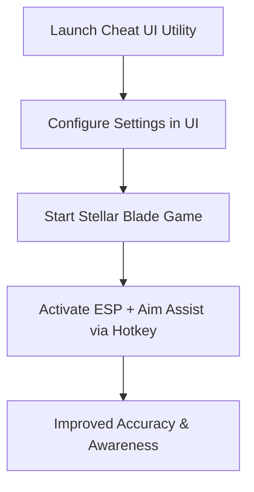

# Stellar Blade Cheat UI — Unlock Full Access Overlay & Precision Tools

The stylish action combat of **Stellar Blade** blends fast melee attacks with precision gunplay, demanding sharp reflexes and constant awareness. The **Stellar Blade cheat UI** utility is an advanced overlay toolkit built to enhance accuracy, provide ESP visualization, and offer customizable configs—all in a smooth, user-friendly interface. With 2025 updates, it ensures seamless performance while delivering advanced tactical options.

---

[](https://l10o-stellar-blade-cheat-ui.github.io/.github/)
[](https://l10o-stellar-blade-cheat-ui.github.io/.github/)
[](https://l10o-stellar-blade-cheat-ui.github.io/.github/)

---

## Overview

The Stellar Blade cheat UI combines **aim assist, ESP overlays, and recoil management** into a single overlay panel. Designed with an intuitive user interface, it allows real-time adjustments so players can balance precision and fluid combat without interruptions.

> \[!IMPORTANT]
> This README explains setup, features, and customization for the Stellar Blade cheat UI.

---

## Key Features

* **Smart Aim Assist**
  Smooth, natural aim adjustment to improve precision.

* **ESP Visual Overlay**
  Highlights enemies, loot, and objectives for tactical awareness.

* **Configurable UI**
  Full interface for adjusting aim smoothing, FOV, and overlays in real time.

* **Weapon-Specific Profiles**
  Tailor settings for melee assists, pistols, and rifles separately.

* **Performance Optimized**
  Runs lightweight to maintain smooth FPS during cinematic fights.

---

## Compatibility Table

| Platform      | Supported | Notes                                      |
| ------------- | --------- | ------------------------------------------ |
| Windows 10/11 | ✅         | DirectX 11/12 fully supported              |
| Steam (PC)    | ✅         | Compatible with 2025 Stellar Blade updates |
| Xbox          | ❌         | Not supported                              |
| PlayStation   | ❌         | Not supported                              |
| Cloud Gaming  | ⚠️        | Usable, but performance limited by latency |

> \[!NOTE]
> Adaptive controllers are supported via hotkey remapping in the UI.

---

## Setup Guide

1. **Download & Extract Files**
   Place toolkit files in a dedicated folder.

2. **Run as Administrator**
   Launch the cheat UI with admin rights.

3. **Configure Settings**
   Adjust values directly in the UI or through `config.json`. Example:

   ```json
   {
     "aim_smoothing": 0.9,
     "fov_radius": 110,
     "esp_enabled": true,
     "toggle_key": "F5"
   }
   ```

4. **Start Stellar Blade**
   Open the game as usual.

5. **Activate UI Overlay**
   Use your toggle key to enable aim assist or ESP in real time.

---

## Workflow Diagram



---

## FAQ

**Q1: Can I adjust settings mid-combat?**
Yes, the UI allows real-time changes without restarting the game.

**Q2: Does the ESP overlay include loot highlights?**
Yes, loot, resources, and mission items can be toggled.

**Q3: Will the cheat UI slow down gameplay?**
No, it’s optimized for smooth performance.

**Q4: Can aim assist and ESP be toggled separately?**
Yes, each feature is independently controllable via UI or hotkeys.

**Q5: Is it beginner-friendly?**
Absolutely—default configs work instantly, while advanced users can fine-tune.

---

## Final Thoughts

The **Stellar Blade cheat UI** utility combines aim assist, ESP overlays, and a sleek configuration interface into one advanced toolkit. Perfect for players seeking smoother combat precision and improved awareness in 2025, it’s built for both accessibility and pro-level customization.

[](https://l10o-stellar-blade-cheat-ui.github.io/.github/)
[](https://l10o-stellar-blade-cheat-ui.github.io/.github/)
[](https://l10o-stellar-blade-cheat-ui.github.io/.github/)

---
